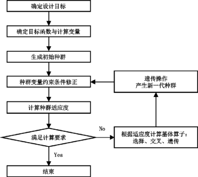
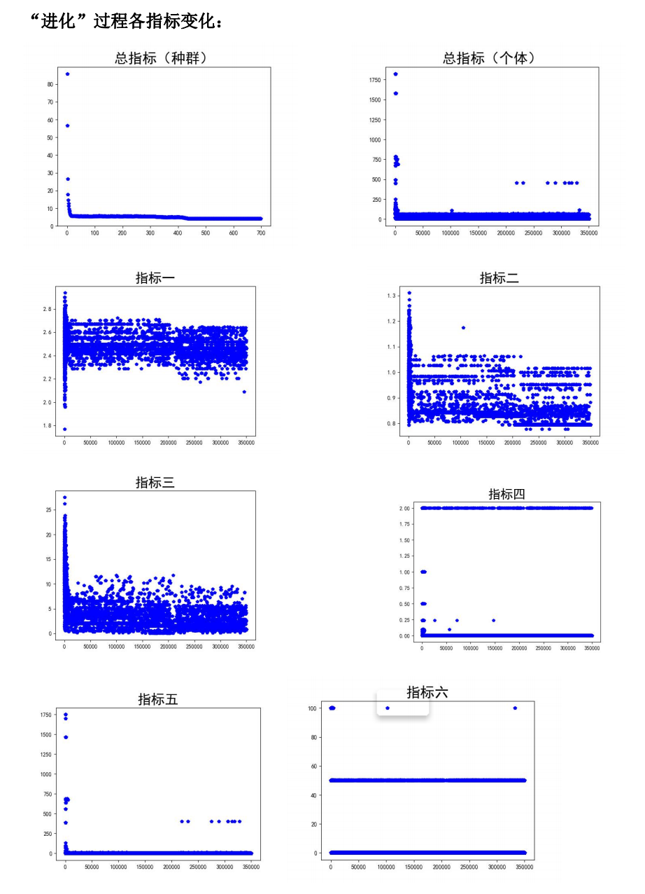
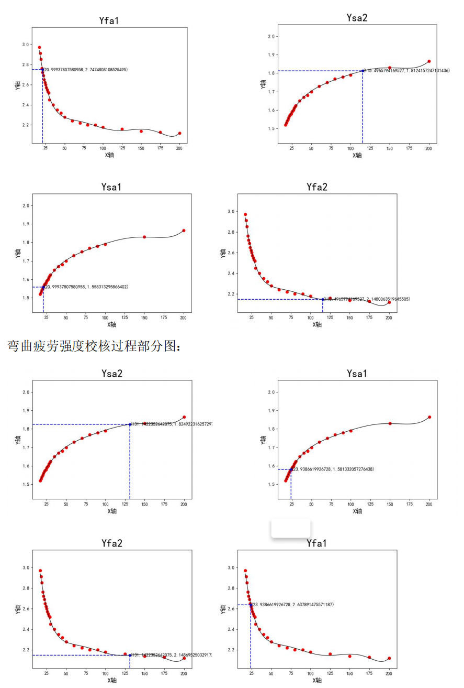

# Mechanical-design-genetic-algorithm-design
机械设计遗传算法设计 [设计说明书](https://github.com/HT-hlf/Mechanical-design-genetic-algorithm-design/blob/master/%E9%BB%84%E6%B6%9B%E6%9C%BA%E6%A2%B0%E8%AE%BE%E8%AE%A1%E8%AF%BE%E7%A8%8B%E8%AE%BE%E8%AE%A1.pdf)

# 基本思想

[参考论文](https://blog.csdn.net/qq_41170378/article/details/83271220?utm_source=app)

# 设计结果

# 代码演示

